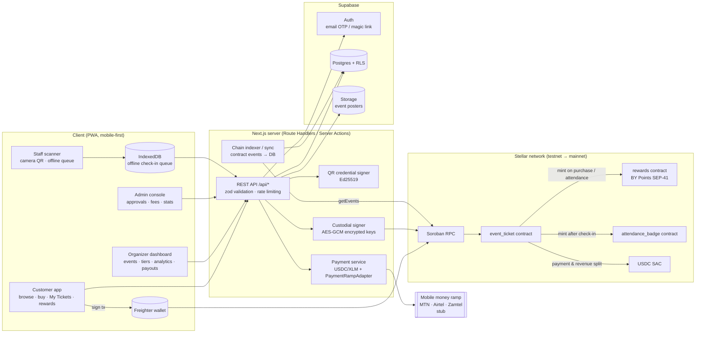
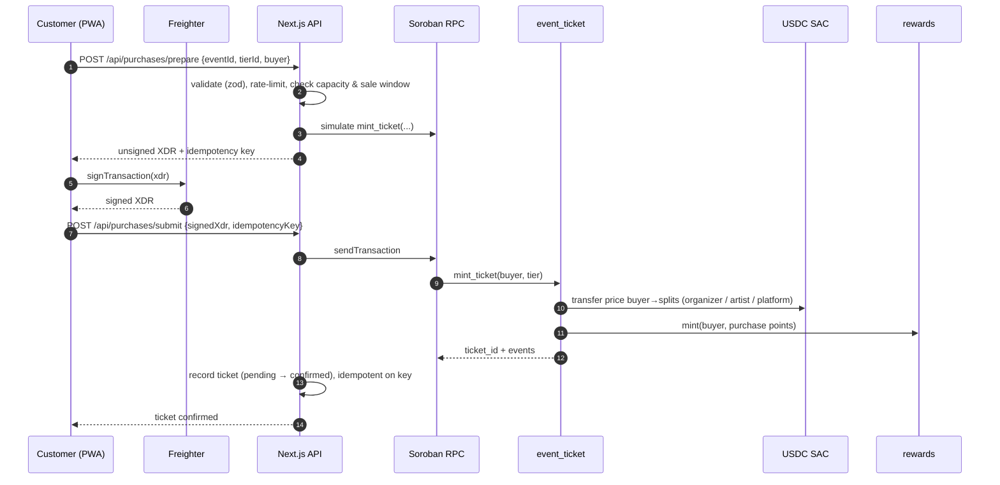
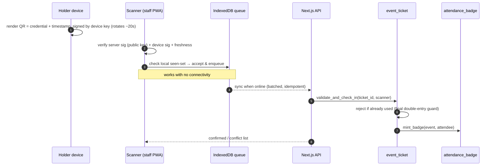

# Architecture

BY Tickets is a mobile-first PWA backed by Supabase for off-chain data and Stellar/Soroban as the source of
truth for **ownership, transfers, check-ins, points and badges**.

## System overview



## Ticket purchase (wallet user)



Email (custodial) users follow the same flow, except the server signs with the user's decrypted custodial
key and the platform account sponsors fees.

## Check-in (works offline)



## Responsibilities: on-chain vs off-chain

| Concern | On-chain (Soroban) | Off-chain (Supabase) |
|---|---|---|
| Ticket ownership & transfers | ✅ source of truth | mirrored for fast queries |
| Capacity / oversell | ✅ enforced in `mint_ticket` | pre-check for UX only |
| Check-in / double entry | ✅ final | offline seen-set on scanner |
| Points & badges | ✅ | cached balances & history |
| Event descriptions, images, tiers metadata | — | ✅ (+ hash anchored on-chain) |
| Users, roles, organizer approval | role addresses on-chain | ✅ profiles, RLS |

## Code layout

```
apps/web/src/
  app/            routes (customer, organizer, scanner, admin) + /api route handlers
  components/     ui/ (shadcn), layout/, feature components
  lib/
    env.ts        zod-validated environment
    stellar/      network config, RPC client, contract clients, Freighter helpers
    supabase/     browser / server / admin clients
    payments/     pricing (USDC ↔ ZMW), PaymentRampAdapter + stub
    security/     rate limiting, QR credentials, key encryption
contracts/        Soroban workspace: event_ticket, rewards, attendance_badge
supabase/         migrations/, seed.sql
scripts/          gen-secrets, deploy-testnet
```
